Analysis
================
Nicholas A. Lester
8/17/2021

# Prosodic structure and the lexicon in interaction: a corpus-based approach

The following code was used to generate the models reported in the
manuscript. There are three model types:

  - model evaluating length as a function of prosodic position

  - models testing the relative pair-wise preference of words to
    specific prosodic position

  - model predicting the duration of a word in each of the three
    prosodic positions as a function of the pertinent variables

## 0\. Preliminaries

**0.1 Clear memory (un-comment to use)**

``` r
# rm(list=ls(all=T))
```

**0.2 Install/load necessary libraries**

``` r
list.of.packages =  c("lmerTest", 
                      "ggplot2", 
                      "visreg", 
                      "mgcv", 
                      "voxel", 
                      "effects", 
                      "languageR", 
                      "fastICA")
new.packages = list.of.packages[!(list.of.packages %in% installed.packages()[,"Package"])]
if(length(new.packages)){
    install.packages(new.packages)
}

invisible(lapply(list.of.packages, library, character.only = TRUE))
```

**0.3 Load data**

``` r
mod_dat = read.table("../Data/data_for_pub.txt", header=T, sep="\t", comment.char="", quote="")

# Restict the data to only tokens with the or a(n) as determiners
mod_dat = mod_dat[mod_dat$Det %in% c("the", "a", "an"),]
```

## 1\. Descriptive stats

This section produces graphs of the type/token counts per position in
our sample.

**1.1 Type counts per position**

``` r
a = length(unique(mod_dat$Noun[mod_dat$facPos=="initial"]))
b = length(unique(mod_dat$Noun[mod_dat$facPos=="final"]))
c = length(unique(mod_dat$Noun[mod_dat$facPos=="medial"]))
# Note that the numbers differ because the AllThreePos condition was
# decided based on lemmas

types = data.frame(value = c(a, c, b), type = c("initial", "medial", "final"), o = c(1, 2, 3))

type.ct.plot = ggplot(data = types, aes(x=reorder(type, o), y=value)) +
  geom_bar(stat="identity", fill = "steelblue", color="black") +
  ylab("Count") +
  xlab("Position") + 
  ggtitle("Type Counts (Lemmas)") +
  theme_bw() +
  theme(plot.title = element_text(hjust = 0.5), text=element_text(size=20, family = "Times New Roman"))

type.ct.plot
```

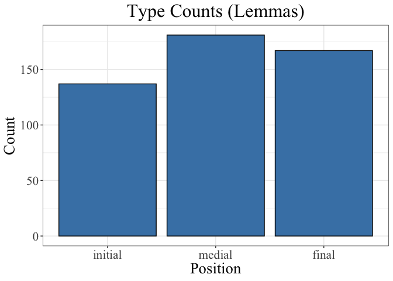<!-- -->

``` r
ggsave(type.ct.plot, file="../Results/type_count_plot.png", units = "in", width = 5, height = 3.5)
```

**1.2 Token counts per position**

``` r
d = length(mod_dat$Noun[mod_dat$facPos=="initial"])
e = length(mod_dat$Noun[mod_dat$facPos=="final"])
f = length(mod_dat$Noun[mod_dat$facPos=="medial"])

tokens = data.frame(value = c(d, f, e), type = c("initial", "medial", "final"), o = c(1, 2, 3))

token.ct.plot = ggplot(data = tokens, aes(x=reorder(type, o), y=value)) +
  geom_bar(stat="identity", fill = "steelblue", color = "black") +
  ylab("Count") +
  xlab("Position") + 
  ggtitle("Token Counts") +
  theme_bw() +
  theme(plot.title = element_text(hjust = 0.5), text=element_text(size=20, family = "Times New Roman"))

token.ct.plot
```

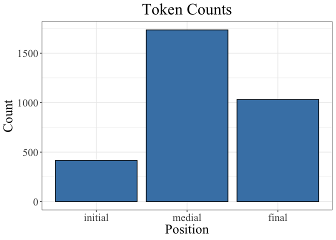<!-- -->

``` r
ggsave(token.ct.plot, file="../Results/token_count_plot.png", units = "in", width = 5, height = 3.5)
```

## 2\. Modeling difference in length between prosodic positions

Here we predict the duration of nouns in each of the prosodic positions
(initial, medial, or final; with the caveat that the nouns are produced
in DET + N constructions).

Outliers were defined as nouns that took longer than 750 ms to produce.

``` r
# Relevel predictors
len.dat = mod_dat[mod_dat$target.duration.ms<750,]
len.dat$facPos = factor(len.dat$facPos, levels = c("initial", "medial", "final"))

length.by.position = bam(target.duration.ms ~ facPos + NPhon_c + s(unsDENS_c) + s(unsLCPOSPAV_c) + s(IU_len_ms_c) + s(IU.speech.rate.graph.per.sec_c) + s(unsBPAV_c) + s(Speaker, bs="re") + s(Lemma, bs="re"), data = len.dat) # remove overly long outliers
```

**2.1 Results**

``` r
anova(length.by.position)
```

    ## 
    ## Family: gaussian 
    ## Link function: identity 
    ## 
    ## Formula:
    ## target.duration.ms ~ facPos + NPhon_c + s(unsDENS_c) + s(unsLCPOSPAV_c) + 
    ##     s(IU_len_ms_c) + s(IU.speech.rate.graph.per.sec_c) + s(unsBPAV_c) + 
    ##     s(Speaker, bs = "re") + s(Lemma, bs = "re")
    ## 
    ## Parametric Terms:
    ##         df      F p-value
    ## facPos   2 89.533  <2e-16
    ## NPhon_c  1  1.384    0.24
    ## 
    ## Approximate significance of smooth terms:
    ##                                       edf  Ref.df      F  p-value
    ## s(unsDENS_c)                        1.000   1.000  1.614   0.2040
    ## s(unsLCPOSPAV_c)                    1.000   1.000  3.159   0.0756
    ## s(IU_len_ms_c)                      6.508   7.598  6.704 2.19e-08
    ## s(IU.speech.rate.graph.per.sec_c)   5.005   6.142 66.497  < 2e-16
    ## s(unsBPAV_c)                        1.540   1.614  1.302   0.2873
    ## s(Speaker)                         78.326 156.000  1.909 1.74e-07
    ## s(Lemma)                          103.451 138.000  6.383  < 2e-16

``` r
len.mod.sum = summary(length.by.position); len.mod.sum
```

    ## 
    ## Family: gaussian 
    ## Link function: identity 
    ## 
    ## Formula:
    ## target.duration.ms ~ facPos + NPhon_c + s(unsDENS_c) + s(unsLCPOSPAV_c) + 
    ##     s(IU_len_ms_c) + s(IU.speech.rate.graph.per.sec_c) + s(unsBPAV_c) + 
    ##     s(Speaker, bs = "re") + s(Lemma, bs = "re")
    ## 
    ## Parametric coefficients:
    ##              Estimate Std. Error t value Pr(>|t|)    
    ## (Intercept)   299.766      8.905  33.663   <2e-16 ***
    ## facPosmedial    7.997      5.405   1.480    0.139    
    ## facPosfinal    60.153      5.726  10.506   <2e-16 ***
    ## NPhon_c        13.443     11.428   1.176    0.240    
    ## ---
    ## Signif. codes:  0 '***' 0.001 '**' 0.01 '*' 0.05 '.' 0.1 ' ' 1
    ## 
    ## Approximate significance of smooth terms:
    ##                                       edf  Ref.df      F  p-value    
    ## s(unsDENS_c)                        1.000   1.000  1.614   0.2040    
    ## s(unsLCPOSPAV_c)                    1.000   1.000  3.159   0.0756 .  
    ## s(IU_len_ms_c)                      6.508   7.598  6.704 2.19e-08 ***
    ## s(IU.speech.rate.graph.per.sec_c)   5.005   6.142 66.497  < 2e-16 ***
    ## s(unsBPAV_c)                        1.540   1.614  1.302   0.2873    
    ## s(Speaker)                         78.326 156.000  1.909 1.74e-07 ***
    ## s(Lemma)                          103.451 138.000  6.383  < 2e-16 ***
    ## ---
    ## Signif. codes:  0 '***' 0.001 '**' 0.01 '*' 0.05 '.' 0.1 ' ' 1
    ## 
    ## R-sq.(adj) =  0.452   Deviance explained = 48.6%
    ## fREML =  18940  Scale est. = 8342.9    n = 3163

``` r
write.table(len.mod.sum$p.table, file="../Results/len.btw.pos_results.txt", sep="\t", quote=F)

write.table(len.mod.sum$s.table, file="../Results/len.btw.pos_results.txt", sep="\t", quote=F, append=T)
```

**2.2 Plotting**

``` r
coeff = summary(length.by.position)$p.coeff[1:3]
coeff[2] = coeff[1]+coeff[2]
coeff[3] = coeff[1]+coeff[3]

ses = summary(length.by.position)$se[1:3]

int_eff = data.frame(fit = coeff, se = ses, type = c("initial", "medial", "final"))

int_eff$type = factor(int_eff$type,levels(int_eff$type)[c(1, 3, 2)])

len.by.pos.plot = ggplot(int_eff, aes(type, fit)) +
  geom_point(color = "darkblue", size = 3) + 
  geom_errorbar(aes(ymin=fit-se, ymax=fit+se), 
                width=.4, size = 2, color="darkblue") + 
  theme_bw(base_size=24) +
  labs(color = "Position in IU", title= element_blank()) +
  ylab("Word duration (ms)") +
  theme(plot.title = element_text(hjust = 0.5), legend.position="top", legend.title = element_blank(), axis.title.y=element_blank(), legend.spacing.x = unit(0.5, 'cm'), text = element_text(family="Times New Roman")) +
  coord_flip()

len.by.pos.plot
```

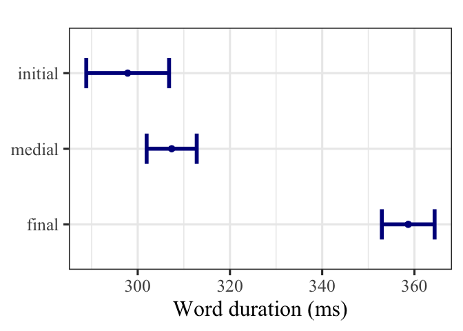<!-- -->

``` r
ggsave(len.by.pos.plot, file="../Results/len_by_pos_plot.png", units = "in", width = 4, height = 3.5)
```

## 3\. Modeling difference in positioinal preferences of words

Here we test whether the syntactic information carried by words
influences where they appear in prosodic phrases.

**3.1 Medial vs. final**

``` r
medial.vs.final = bam(facPos ~ Det + Animacy.simplified + s(lexICA1) + s(lexICA2) + s(lexICA3) + s(lexICA4) + s(lexICA5) + s(lexICA6) + s(lexICA7) + s(lexICA8) + s(lexICA9) + s(BigSurp_c) + s(Speaker,  bs="re") + s(Lemma, bs="re"), data = mod_dat[mod_dat$facPos!="initial",], family="binomial")
```

*3.1.1 Results*

``` r
m.v.f.results = summary(medial.vs.final); m.v.f.results
```

    ## 
    ## Family: binomial 
    ## Link function: logit 
    ## 
    ## Formula:
    ## facPos ~ Det + Animacy.simplified + s(lexICA1) + s(lexICA2) + 
    ##     s(lexICA3) + s(lexICA4) + s(lexICA5) + s(lexICA6) + s(lexICA7) + 
    ##     s(lexICA8) + s(lexICA9) + s(BigSurp_c) + s(Speaker, bs = "re") + 
    ##     s(Lemma, bs = "re")
    ## 
    ## Parametric coefficients:
    ##                             Estimate Std. Error z value Pr(>|z|)  
    ## (Intercept)                  0.46973    0.25978   1.808   0.0706 .
    ## Detan                        1.08997    0.81042   1.345   0.1786  
    ## Detthe                       0.01184    0.12646   0.094   0.9254  
    ## Animacy.simplifiedinanimate  0.10466    0.26994   0.388   0.6982  
    ## ---
    ## Signif. codes:  0 '***' 0.001 '**' 0.01 '*' 0.05 '.' 0.1 ' ' 1
    ## 
    ## Approximate significance of smooth terms:
    ##                 edf  Ref.df  Chi.sq  p-value    
    ## s(lexICA1)    1.000   1.000   2.811 0.093627 .  
    ## s(lexICA2)    1.000   1.000   1.450 0.228516    
    ## s(lexICA3)    2.280   2.563   8.393 0.027165 *  
    ## s(lexICA4)    1.000   1.000  21.989 2.74e-06 ***
    ## s(lexICA5)    2.803   3.188   5.747 0.121475    
    ## s(lexICA6)    1.061   1.089   2.037 0.177451    
    ## s(lexICA7)    1.000   1.000   0.380 0.537440    
    ## s(lexICA8)    1.273   1.385   1.496 0.217174    
    ## s(lexICA9)    1.000   1.000   0.956 0.328087    
    ## s(BigSurp_c)  2.965   3.632   4.352 0.275919    
    ## s(Speaker)   37.525 153.000  62.003 0.000724 ***
    ## s(Lemma)     45.032 113.000 114.588 1.11e-11 ***
    ## ---
    ## Signif. codes:  0 '***' 0.001 '**' 0.01 '*' 0.05 '.' 0.1 ' ' 1
    ## 
    ## R-sq.(adj) =  0.133   Deviance explained = 13.4%
    ## fREML = 3665.9  Scale est. = 1         n = 2574

``` r
anova(medial.vs.final)
```

    ## 
    ## Family: binomial 
    ## Link function: logit 
    ## 
    ## Formula:
    ## facPos ~ Det + Animacy.simplified + s(lexICA1) + s(lexICA2) + 
    ##     s(lexICA3) + s(lexICA4) + s(lexICA5) + s(lexICA6) + s(lexICA7) + 
    ##     s(lexICA8) + s(lexICA9) + s(BigSurp_c) + s(Speaker, bs = "re") + 
    ##     s(Lemma, bs = "re")
    ## 
    ## Parametric Terms:
    ##                    df Chi.sq p-value
    ## Det                 2   1.81   0.405
    ## Animacy.simplified  1   0.15   0.698
    ## 
    ## Approximate significance of smooth terms:
    ##                  edf  Ref.df  Chi.sq  p-value
    ## s(lexICA1)     1.000   1.000   2.811 0.093627
    ## s(lexICA2)     1.000   1.000   1.450 0.228516
    ## s(lexICA3)     2.280   2.563   8.393 0.027165
    ## s(lexICA4)     1.000   1.000  21.989 2.74e-06
    ## s(lexICA5)     2.803   3.188   5.747 0.121475
    ## s(lexICA6)     1.061   1.089   2.037 0.177451
    ## s(lexICA7)     1.000   1.000   0.380 0.537440
    ## s(lexICA8)     1.273   1.385   1.496 0.217174
    ## s(lexICA9)     1.000   1.000   0.956 0.328087
    ## s(BigSurp_c)   2.965   3.632   4.352 0.275919
    ## s(Speaker)    37.525 153.000  62.003 0.000724
    ## s(Lemma)      45.032 113.000 114.588 1.11e-11

``` r
write.table(m.v.f.results$p.table, file="../Results/m.v.f_results.txt", sep="\t", quote=F)

write.table(m.v.f.results$s.table, file="../Results/m.v.f_results.txt", sep="\t", quote=F, append=T)
```

*3.1.2 Plotting*

``` r
# Construct hypothetical dataset (non-target variables held at median or alphabetically prior level)
orig_data = mod_dat[mod_dat$facPos!="initial",]
new_data = with(orig_data, 
                expand.grid(lexICA4 = seq(min(lexICA4), 
                                              max(lexICA4), 
                                              length = 10),
                            lexICA1 = median(lexICA1),
                            lexICA2 = median(lexICA2),
                            lexICA3 = median(lexICA3),
                            lexICA5 = median(lexICA5),
                            lexICA6 = median(lexICA6),
                            lexICA7 = median(lexICA7),
                            lexICA8 = median(lexICA8),
                            lexICA9 = median(lexICA9),
                            BigSurp_c = median(BigSurp_c),
                            Det = "a",
                            Speaker = "AL",
                            Lemma = "air",
                            Animacy.simplified = "inanimate"))

# Define the link function for back-transforming
ilink = family(medial.vs.final)$linkinv

# Generate predicted values in log-odds (without random effects)
pred = predict(medial.vs.final, 
               new_data, 
               type = "link", 
               se.fit = TRUE, 
               exclude = c("s(Speaker)", "s(Lemma)", "Animacy.simplified", "Det"))

# Add the predicted values to our hypothetical dataframe
pred = cbind(pred, new_data)

# Back-transform fitted values and CIs into the response scale (i.e., probabilities rather than log-odds)
pred = transform(pred, lwr_ci = ilink(fit - (2 * se.fit)),
                       upr_ci = ilink(fit + (2 * se.fit)),
                       fitted = ilink(fit))

# Plot the result
m.v.f = ggplot(pred, aes(x = lexICA4, y = fitted)) +
        geom_ribbon(aes(ymin = lwr_ci, ymax = upr_ci), 
                    fill = "dodgerblue",
                    color = "dodgerblue",
                    alpha = 0.2) +
        geom_line() +
        geom_hline(yintercept=.5, lty=2, color="grey50") +
        ylim(0,1) +
        annotate("text", 
                 x = -2, 
                 y = .85, 
                 label = "medial", 
                 family = "Times New Roman", 
                 hjust=0) +
        annotate("text", 
                 x=-2, 
                 y=.15, 
                 label = "final", 
                 family="Times New Roman", 
                 hjust=0) +
        xlab("Component 4 (syntactic diversity →)") +
        ylab("Probability") +
        theme_bw() +
         theme(text = element_text(family="Times New Roman",
                                   size=14,
                                   face="bold"))

m.v.f
```

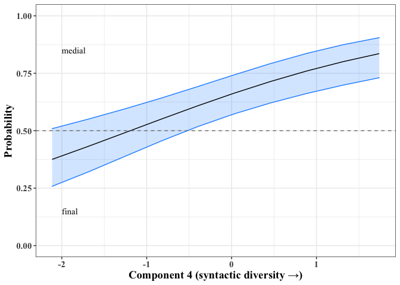<!-- -->

``` r
ggsave(m.v.f, file = "../Results/medial_vs_final_plot.png", units="in", width = 5, height = 3.5, device = "png")
```

**3.2 Initial vs. medial**

``` r
initial.vs.medial = bam(facPos ~ Det + Animacy.simplified + s(lexICA1) + s(lexICA2) + s(lexICA3) + s(lexICA4) + s(lexICA5) + s(lexICA6) + s(lexICA7) + s(lexICA8) + s(lexICA9) + s(BigSurp_c) + s(Speaker,  bs="re") + s(Lemma, bs="re"), data=mod_dat[mod_dat$facPos!="final",], family="binomial")
```

*3.2.1 Results*

``` r
i.v.m.results = summary(initial.vs.medial); i.v.m.results
```

    ## 
    ## Family: binomial 
    ## Link function: logit 
    ## 
    ## Formula:
    ## facPos ~ Det + Animacy.simplified + s(lexICA1) + s(lexICA2) + 
    ##     s(lexICA3) + s(lexICA4) + s(lexICA5) + s(lexICA6) + s(lexICA7) + 
    ##     s(lexICA8) + s(lexICA9) + s(BigSurp_c) + s(Speaker, bs = "re") + 
    ##     s(Lemma, bs = "re")
    ## 
    ## Parametric coefficients:
    ##                             Estimate Std. Error z value Pr(>|z|)    
    ## (Intercept)                   1.1518     0.2462   4.678  2.9e-06 ***
    ## Detan                        11.9086   166.5330   0.072   0.9430    
    ## Detthe                       -0.2730     0.1667  -1.638   0.1015    
    ## Animacy.simplifiedinanimate   0.5528     0.2469   2.239   0.0252 *  
    ## ---
    ## Signif. codes:  0 '***' 0.001 '**' 0.01 '*' 0.05 '.' 0.1 ' ' 1
    ## 
    ## Approximate significance of smooth terms:
    ##                 edf  Ref.df Chi.sq p-value   
    ## s(lexICA1)    1.000   1.000  0.527 0.46768   
    ## s(lexICA2)    1.000   1.000  5.424 0.01986 * 
    ## s(lexICA3)    1.000   1.000  0.035 0.85136   
    ## s(lexICA4)    1.000   1.000  7.735 0.00541 **
    ## s(lexICA5)    1.000   1.000  0.621 0.43058   
    ## s(lexICA6)    1.000   1.000  0.378 0.53850   
    ## s(lexICA7)    1.000   1.000  0.002 0.96353   
    ## s(lexICA8)    1.000   1.000  1.183 0.27669   
    ## s(lexICA9)    2.124   2.495  3.068 0.26838   
    ## s(BigSurp_c)  1.000   1.000  0.399 0.52742   
    ## s(Speaker)   20.779 149.000 27.787 0.02709 * 
    ## s(Lemma)     17.888 113.000 27.054 0.00551 **
    ## ---
    ## Signif. codes:  0 '***' 0.001 '**' 0.01 '*' 0.05 '.' 0.1 ' ' 1
    ## 
    ## R-sq.(adj) =  0.0411   Deviance explained = 6.66%
    ## fREML =   2830  Scale est. = 1         n = 2019

``` r
anova(initial.vs.medial)
```

    ## 
    ## Family: binomial 
    ## Link function: logit 
    ## 
    ## Formula:
    ## facPos ~ Det + Animacy.simplified + s(lexICA1) + s(lexICA2) + 
    ##     s(lexICA3) + s(lexICA4) + s(lexICA5) + s(lexICA6) + s(lexICA7) + 
    ##     s(lexICA8) + s(lexICA9) + s(BigSurp_c) + s(Speaker, bs = "re") + 
    ##     s(Lemma, bs = "re")
    ## 
    ## Parametric Terms:
    ##                    df Chi.sq p-value
    ## Det                 2  2.687  0.2609
    ## Animacy.simplified  1  5.013  0.0252
    ## 
    ## Approximate significance of smooth terms:
    ##                  edf  Ref.df Chi.sq p-value
    ## s(lexICA1)     1.000   1.000  0.527 0.46768
    ## s(lexICA2)     1.000   1.000  5.424 0.01986
    ## s(lexICA3)     1.000   1.000  0.035 0.85136
    ## s(lexICA4)     1.000   1.000  7.735 0.00541
    ## s(lexICA5)     1.000   1.000  0.621 0.43058
    ## s(lexICA6)     1.000   1.000  0.378 0.53850
    ## s(lexICA7)     1.000   1.000  0.002 0.96353
    ## s(lexICA8)     1.000   1.000  1.183 0.27669
    ## s(lexICA9)     2.124   2.495  3.068 0.26838
    ## s(BigSurp_c)   1.000   1.000  0.399 0.52742
    ## s(Speaker)    20.779 149.000 27.787 0.02709
    ## s(Lemma)      17.888 113.000 27.054 0.00551

``` r
write.table(i.v.m.results$p.table, file="../Results/i.v.m_results.txt", sep="\t", quote=F)

write.table(i.v.m.results$s.table, file="../Results/i.v.m_results.txt", sep="\t", quote=F, append=T)
```

*3.2.2 Plotting*

``` r
# Construct hypothetical dataset (non-target variables held at median or alphabetically prior level)
orig_data = mod_dat[mod_dat$facPos!="final",]
new_data = with(orig_data, 
                expand.grid(lexICA4 = seq(min(lexICA4), 
                                              max(lexICA4), 
                                              length = 10),
                            lexICA1 = median(lexICA1),
                            lexICA2 = median(lexICA2),
                            lexICA3 = median(lexICA3),
                            lexICA5 = median(lexICA5),
                            lexICA6 = median(lexICA6),
                            lexICA7 = median(lexICA7),
                            lexICA8 = median(lexICA8),
                            lexICA9 = median(lexICA9),
                            BigSurp_c = median(BigSurp_c),
                            Det = "a",
                            Speaker = "AL",
                            Lemma = "air",
                            Animacy.simplified = "inanimate"))

# Define the link function for back-transforming
ilink = family(initial.vs.medial)$linkinv

# Generate predicted values in log-odds (without random effects)
pred = predict(initial.vs.medial, 
               new_data, 
               type = "link", 
               se.fit = TRUE, 
               exclude = c("s(Speaker)", "s(Lemma)", "Det", "Animacy.simplfied"))

# Add the predicted values to our hypothetical dataframe
pred = cbind(pred, new_data)

# Back-transform fitted values and CIs into the response scale (i.e., probabilities rather than log-odds)
pred = transform(pred, lwr_ci = ilink(fit - (2 * se.fit)),
                       upr_ci = ilink(fit + (2 * se.fit)),
                       fitted = ilink(fit))

# Plot the result
i.v.m = ggplot(pred, aes(x = lexICA4, y = fitted)) +
        geom_ribbon(aes(ymin = lwr_ci, ymax = upr_ci), 
                    fill = "dodgerblue",
                    color = "dodgerblue",
                    alpha = 0.2) +
        geom_line() +
        geom_hline(yintercept=.5, lty=2, color="grey50") +
        ylim(0,1) +
        annotate("text", 
                 x = -2, 
                 y = .75, 
                 label = "medial", 
                 family = "Times New Roman", 
                 hjust=0) +
        annotate("text", 
                 x=-2, 
                 y=.25, 
                 label = "initial", 
                 family="Times New Roman", 
                 hjust=0) +
        xlab("Component 4 (syntactic diversity →)") +
        ylab("Probability") +
        theme_bw() +
         theme(text = element_text(family="Times New Roman",
                                   size=14,
                                   face="bold"))

i.v.m
```

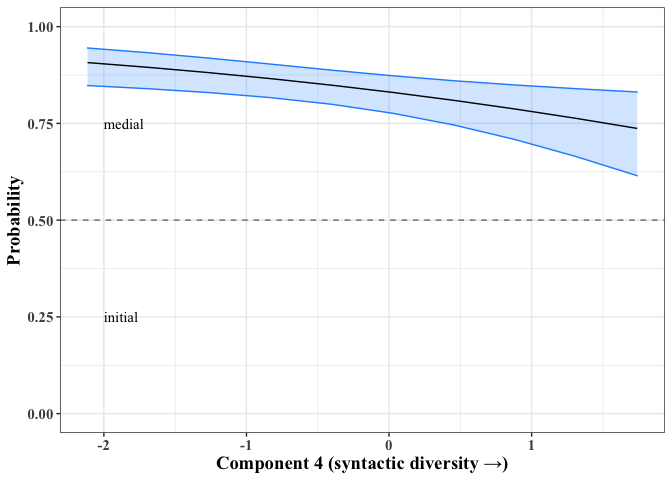<!-- -->

``` r
ggsave(i.v.m, file = "../Results/initial_vs_medial_plot.png", units="in", width = 5, height = 3.5, device = "png")
```

**3.3 Initial vs. final**

``` r
initial.vs.final = bam(facPos ~ Det + Animacy.simplified + s(lexICA1) + s(lexICA2) + s(lexICA3) + s(lexICA4) + s(lexICA5) + s(lexICA6) + s(lexICA7) + s(lexICA8) + s(lexICA9) + s(BigSurp_c) + s(Speaker,  bs="re") + s(Lemma, bs="re"), data=mod_dat[mod_dat$facPos!="medial",], family="binomial")
```

*3.3.1 Results*

``` r
i.v.f.results = summary(initial.vs.final); i.v.f.results
```

    ## 
    ## Family: binomial 
    ## Link function: logit 
    ## 
    ## Formula:
    ## facPos ~ Det + Animacy.simplified + s(lexICA1) + s(lexICA2) + 
    ##     s(lexICA3) + s(lexICA4) + s(lexICA5) + s(lexICA6) + s(lexICA7) + 
    ##     s(lexICA8) + s(lexICA9) + s(BigSurp_c) + s(Speaker, bs = "re") + 
    ##     s(Lemma, bs = "re")
    ## 
    ## Parametric coefficients:
    ##                             Estimate Std. Error z value Pr(>|z|)   
    ## (Intercept)                  -0.9383     0.3088  -3.038  0.00238 **
    ## Detan                       -11.0479   113.5465  -0.097  0.92249   
    ## Detthe                        0.2124     0.1928   1.102  0.27056   
    ## Animacy.simplifiedinanimate  -0.2086     0.3152  -0.662  0.50811   
    ## ---
    ## Signif. codes:  0 '***' 0.001 '**' 0.01 '*' 0.05 '.' 0.1 ' ' 1
    ## 
    ## Approximate significance of smooth terms:
    ##                 edf  Ref.df Chi.sq  p-value    
    ## s(lexICA1)    1.000   1.000  2.035  0.15370    
    ## s(lexICA2)    1.000   1.000  0.026  0.87203    
    ## s(lexICA3)    1.000   1.000  4.450  0.03491 *  
    ## s(lexICA4)    1.000   1.000 35.019 3.27e-09 ***
    ## s(lexICA5)    2.183   2.566  2.644  0.29339    
    ## s(lexICA6)    1.811   2.105  1.235  0.64441    
    ## s(lexICA7)    1.000   1.000  0.690  0.40620    
    ## s(lexICA8)    1.187   1.286  0.050  0.88596    
    ## s(lexICA9)    1.000   1.000  0.485  0.48596    
    ## s(BigSurp_c)  1.206   1.349  3.659  0.08043 .  
    ## s(Speaker)   26.228 142.000 40.182  0.00338 ** 
    ## s(Lemma)     32.282 111.000 68.337 1.17e-07 ***
    ## ---
    ## Signif. codes:  0 '***' 0.001 '**' 0.01 '*' 0.05 '.' 0.1 ' ' 1
    ## 
    ## R-sq.(adj) =  0.187   Deviance explained = 19.7%
    ## fREML = 1892.8  Scale est. = 1         n = 1347

``` r
anova(initial.vs.final)
```

    ## 
    ## Family: binomial 
    ## Link function: logit 
    ## 
    ## Formula:
    ## facPos ~ Det + Animacy.simplified + s(lexICA1) + s(lexICA2) + 
    ##     s(lexICA3) + s(lexICA4) + s(lexICA5) + s(lexICA6) + s(lexICA7) + 
    ##     s(lexICA8) + s(lexICA9) + s(BigSurp_c) + s(Speaker, bs = "re") + 
    ##     s(Lemma, bs = "re")
    ## 
    ## Parametric Terms:
    ##                    df Chi.sq p-value
    ## Det                 2  1.224   0.542
    ## Animacy.simplified  1  0.438   0.508
    ## 
    ## Approximate significance of smooth terms:
    ##                  edf  Ref.df Chi.sq  p-value
    ## s(lexICA1)     1.000   1.000  2.035  0.15370
    ## s(lexICA2)     1.000   1.000  0.026  0.87203
    ## s(lexICA3)     1.000   1.000  4.450  0.03491
    ## s(lexICA4)     1.000   1.000 35.019 3.27e-09
    ## s(lexICA5)     2.183   2.566  2.644  0.29339
    ## s(lexICA6)     1.811   2.105  1.235  0.64441
    ## s(lexICA7)     1.000   1.000  0.690  0.40620
    ## s(lexICA8)     1.187   1.286  0.050  0.88596
    ## s(lexICA9)     1.000   1.000  0.485  0.48596
    ## s(BigSurp_c)   1.206   1.349  3.659  0.08043
    ## s(Speaker)    26.228 142.000 40.182  0.00338
    ## s(Lemma)      32.282 111.000 68.337 1.17e-07

``` r
write.table(i.v.f.results$p.table, file="../Results/i.v.f_results.txt", sep="\t", quote=F)

write.table(i.v.f.results$s.table, file="../Results/i.v.f_results.txt", sep="\t", quote=F, append=T)
```

*3.3.2 Plotting*

``` r
# Construct hypothetical dataset (non-target variables held at median or alphabetically prior level)
orig_data = mod_dat[mod_dat$facPos!="medial",]
new_data = with(orig_data, 
                expand.grid(lexICA4 = seq(min(lexICA4), 
                                              max(lexICA4), 
                                              length = 10),
                            lexICA1 = median(lexICA1),
                            lexICA2 = median(lexICA2),
                            lexICA3 = median(lexICA3),
                            lexICA5 = median(lexICA5),
                            lexICA6 = median(lexICA6),
                            lexICA7 = median(lexICA7),
                            lexICA8 = median(lexICA8),
                            lexICA9 = median(lexICA9),
                            BigSurp_c = median(BigSurp_c),
                            Det = "a",
                            Speaker = "AL",
                            Lemma = "air",
                            Animacy.simplified = "inanimate"))

# Define the link function for back-transforming
ilink = family(initial.vs.final)$linkinv

# Generate predicted values in log-odds (without random effects)
pred = predict(initial.vs.final, 
               new_data, 
               type = "link", 
               se.fit = TRUE, 
               exclude = c("s(Speaker)", "s(Lemma)", "Det", "Animacy.simplified"))

# Add the predicted values to our hypothetical dataframe
pred = cbind(pred, new_data)

# Back-transform fitted values and CIs into the response scale (i.e., probabilities rather than log-odds)
pred = transform(pred, lwr_ci = ilink(fit - (2 * se.fit)),
                       upr_ci = ilink(fit + (2 * se.fit)),
                       fitted = ilink(fit))

# Plot the result
i.v.f = ggplot(pred, aes(x = lexICA4, y = fitted)) +
        geom_ribbon(aes(ymin = lwr_ci, ymax = upr_ci), 
                    fill = "dodgerblue",
                    color = "dodgerblue",
                    alpha = 0.2) +
        geom_line() +
        geom_hline(yintercept=.5, lty=2, color="grey50") +
        ylim(0,1) +
        annotate("text", 
                 x = -2, 
                 y = .75, 
                 label = "initial", 
                 family = "Times New Roman", 
                 hjust=0) +
        annotate("text", 
                 x=-2, 
                 y=.25, 
                 label = "final", 
                 family="Times New Roman", 
                 hjust=0) +
        xlab("Component 4 (syntactic diversity →)") +
        ylab("Probability") +
        theme_bw() +
         theme(text = element_text(family="Times New Roman",
                                   size=14,
                                   face="bold"))

i.v.f
```

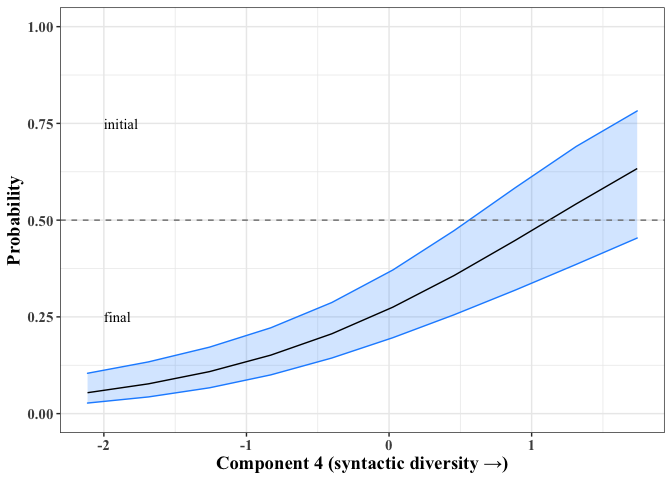<!-- -->

``` r
ggsave(i.v.f, file = "../Results/initial_vs_final_plot.png", units="in", width = 5, height = 3.5, device = "png")
```

**3.4 Correct p-values for multiple comparisons (Benjamini-Yekutieli
method)** Because we are performing multiple tests on the same data, we
correct the p-values from all models.

*3.4.1 Get p-values from each model*

``` r
## Medial vs. final
test1 = summary(medial.vs.final)

## Initial vs. medial
test2 = summary(initial.vs.medial)

## Initial vs. final
test3 = summary(initial.vs.final)
```

*3.4.2 Concatenate all p’s*

``` r
pvals = c(test1$p.pv, test1$s.pv[1:10], test2$p.pv, test2$s.pv[1:10], test3$p.pv, test3$s.pv[1:10])
```

*3.4.3 Adjust p-values with B-Y (false-discovery rate) correction and
add to data*

``` r
adjustedPs = p.adjust(pvals, method="BY")

## 3.4.6 Put adjusted p's into a human-readable table
model.label.1 = rep("medial_vs_final", 14)
model.label.2 = rep("initial_vs_medial", 14)
model.label.3 = rep("initial_vs_final", 14)

model.labels = c(model.label.1, model.label.2, model.label.3)

p.df = data.frame(Model = model.labels, Variable = rep(c("Intercept", "Determiner: an", "Determiner: the", "Animacy: inanimate", "Component 1", "Component 2", "Component 3", "Component 4", "Component 5", "Component 6", "Component 7", "Component 8", "Component 9", "Bigram surprisal"), 3), p.values = round(pvals, 3), corrected.p.values = round(adjustedPs, 3))

p.df
```

    ##                Model           Variable p.values corrected.p.values
    ## 1    medial_vs_final          Intercept    0.071              1.000
    ## 2    medial_vs_final     Determiner: an    0.179              1.000
    ## 3    medial_vs_final    Determiner: the    0.925              1.000
    ## 4    medial_vs_final Animacy: inanimate    0.698              1.000
    ## 5    medial_vs_final        Component 1    0.094              1.000
    ## 6    medial_vs_final        Component 2    0.229              1.000
    ## 7    medial_vs_final        Component 3    0.027              0.617
    ## 8    medial_vs_final        Component 4    0.000              0.000
    ## 9    medial_vs_final        Component 5    0.121              1.000
    ## 10   medial_vs_final        Component 6    0.177              1.000
    ## 11   medial_vs_final        Component 7    0.537              1.000
    ## 12   medial_vs_final        Component 8    0.217              1.000
    ## 13   medial_vs_final        Component 9    0.328              1.000
    ## 14   medial_vs_final   Bigram surprisal    0.276              1.000
    ## 15 initial_vs_medial          Intercept    0.000              0.000
    ## 16 initial_vs_medial     Determiner: an    0.943              1.000
    ## 17 initial_vs_medial    Determiner: the    0.101              1.000
    ## 18 initial_vs_medial Animacy: inanimate    0.025              0.617
    ## 19 initial_vs_medial        Component 1    0.468              1.000
    ## 20 initial_vs_medial        Component 2    0.020              0.601
    ## 21 initial_vs_medial        Component 3    0.851              1.000
    ## 22 initial_vs_medial        Component 4    0.005              0.197
    ## 23 initial_vs_medial        Component 5    0.431              1.000
    ## 24 initial_vs_medial        Component 6    0.538              1.000
    ## 25 initial_vs_medial        Component 7    0.964              1.000
    ## 26 initial_vs_medial        Component 8    0.277              1.000
    ## 27 initial_vs_medial        Component 9    0.268              1.000
    ## 28 initial_vs_medial   Bigram surprisal    0.527              1.000
    ## 29  initial_vs_final          Intercept    0.002              0.108
    ## 30  initial_vs_final     Determiner: an    0.922              1.000
    ## 31  initial_vs_final    Determiner: the    0.271              1.000
    ## 32  initial_vs_final Animacy: inanimate    0.508              1.000
    ## 33  initial_vs_final        Component 1    0.154              1.000
    ## 34  initial_vs_final        Component 2    0.872              1.000
    ## 35  initial_vs_final        Component 3    0.035              0.705
    ## 36  initial_vs_final        Component 4    0.000              0.000
    ## 37  initial_vs_final        Component 5    0.293              1.000
    ## 38  initial_vs_final        Component 6    0.644              1.000
    ## 39  initial_vs_final        Component 7    0.406              1.000
    ## 40  initial_vs_final        Component 8    0.886              1.000
    ## 41  initial_vs_final        Component 9    0.486              1.000
    ## 42  initial_vs_final   Bigram surprisal    0.080              1.000

``` r
write.table(p.df, file = "../Results/glmer_adjusted_pvalues.txt", sep = "\t", row.names = F, quote = F)

# Adjusting only p-values for the critical predictors
crit.pvals = c(test1$s.pv[c(2,4:5)], test2$s.pv[c(2,4:5)], test3$s.pv[c(2,4:5)])

crit.adjustedPs = p.adjust(crit.pvals, method="BY")
crit.mod.labels = c(rep(c("medial_vs_final", "initial_vs_medial", "initial_vs_final"), each=3))

crit.p.df = data.frame(Model = crit.mod.labels, Variable = rep(c("Component 2", "Component 4", "Component 5"), each = 3), p.values = round(crit.pvals, 3), corrected.p.values = round(crit.adjustedPs, 3))

crit.p.df
```

    ##               Model    Variable p.values corrected.p.values
    ## 1   medial_vs_final Component 2    0.229              0.970
    ## 2   medial_vs_final Component 2    0.000              0.000
    ## 3   medial_vs_final Component 2    0.121              0.619
    ## 4 initial_vs_medial Component 4    0.020              0.126
    ## 5 initial_vs_medial Component 4    0.005              0.046
    ## 6 initial_vs_medial Component 4    0.431              1.000
    ## 7  initial_vs_final Component 5    0.872              1.000
    ## 8  initial_vs_final Component 5    0.000              0.000
    ## 9  initial_vs_final Component 5    0.293              1.000

``` r
write.table(crit.p.df, file = "../Results/glmer_adjusted_pvalues_critical_vars_only.txt", sep = "\t", row.names = F, quote = F)
```

## 4\. Modeling differences in duration within positions

Finally, we look inside each prosodic position to see if the
lexico-syntactic variables play a role in determining duration.

Overly long nouns (\> 750 ms) were removed prior to the analysis.

``` r
duration.in.position = bam(target.duration.ms ~ Det + Animacy.simplified + s(lexICA1, by=facPos) + s(lexICA2, by=facPos) + s(lexICA3, by=facPos) + s(lexICA4, by=facPos) + s(lexICA5, by=facPos) + s(lexICA6, by=facPos) + s(lexICA7, by=facPos) + s(lexICA8, by=facPos) + s(lexICA9, by=facPos) + s(IU.speech.rate.graph.per.sec_c, by=facPos) + s(IU_len_ms_c, by=facPos) + s(BigSurp_c, by=facPos) + s(Lemma, bs="re") + s(Speaker, bs="re"), data=mod_dat[mod_dat$target.duration.ms<750,])

# With syllable-based IU speech rate measure
duration.in.position.wSyll = bam(target.duration.ms ~ Det + Animacy.simplified + s(lexICA1, by=facPos) + s(lexICA2, by=facPos) + s(lexICA3, by=facPos) + s(lexICA4, by=facPos) + s(lexICA5, by=facPos) + s(lexICA6, by=facPos) + s(lexICA7, by=facPos) + s(lexICA8, by=facPos) + s(lexICA9, by=facPos) + s(IU.speech.rate.syll.per.sec_c, by=facPos) + s(IU_len_ms_c, by=facPos) + s(BigSurp_c, by=facPos) + s(Lemma, bs="re") + s(Speaker, bs="re"), data=mod_dat[mod_dat$target.duration.ms<750,])
```

**4.1 Results**

``` r
duration.results = summary(duration.in.position); duration.results
```

    ## 
    ## Family: gaussian 
    ## Link function: identity 
    ## 
    ## Formula:
    ## target.duration.ms ~ Det + Animacy.simplified + s(lexICA1, by = facPos) + 
    ##     s(lexICA2, by = facPos) + s(lexICA3, by = facPos) + s(lexICA4, 
    ##     by = facPos) + s(lexICA5, by = facPos) + s(lexICA6, by = facPos) + 
    ##     s(lexICA7, by = facPos) + s(lexICA8, by = facPos) + s(lexICA9, 
    ##     by = facPos) + s(IU.speech.rate.graph.per.sec_c, by = facPos) + 
    ##     s(IU_len_ms_c, by = facPos) + s(BigSurp_c, by = facPos) + 
    ##     s(Lemma, bs = "re") + s(Speaker, bs = "re")
    ## 
    ## Parametric coefficients:
    ##                             Estimate Std. Error t value Pr(>|t|)    
    ## (Intercept)                  285.721     16.502  17.314   <2e-16 ***
    ## Detan                         47.289     33.230   1.423    0.155    
    ## Detthe                         5.465      5.453   1.002    0.316    
    ## Animacy.simplifiedinanimate   14.336     17.082   0.839    0.401    
    ## ---
    ## Signif. codes:  0 '***' 0.001 '**' 0.01 '*' 0.05 '.' 0.1 ' ' 1
    ## 
    ## Approximate significance of smooth terms:
    ##                                                    edf  Ref.df       F
    ## s(lexICA1):facPosfinal                           2.480   3.024   1.095
    ## s(lexICA1):facPosinitial                         2.794   3.404   2.798
    ## s(lexICA1):facPosmedial                          1.000   1.000  11.521
    ## s(lexICA2):facPosfinal                           1.000   1.000   3.055
    ## s(lexICA2):facPosinitial                         1.000   1.000   0.164
    ## s(lexICA2):facPosmedial                          1.000   1.000  15.509
    ## s(lexICA3):facPosfinal                           1.000   1.000   0.940
    ## s(lexICA3):facPosinitial                         1.000   1.000   1.979
    ## s(lexICA3):facPosmedial                          1.540   1.832   0.795
    ## s(lexICA4):facPosfinal                           1.000   1.000   3.229
    ## s(lexICA4):facPosinitial                         1.007   1.013   0.006
    ## s(lexICA4):facPosmedial                          1.000   1.001   0.192
    ## s(lexICA5):facPosfinal                           2.109   2.554   2.021
    ## s(lexICA5):facPosinitial                         1.000   1.000   5.084
    ## s(lexICA5):facPosmedial                          3.563   4.221   2.421
    ## s(lexICA6):facPosfinal                           1.000   1.000  15.410
    ## s(lexICA6):facPosinitial                         3.048   3.784   4.825
    ## s(lexICA6):facPosmedial                          1.000   1.000   8.704
    ## s(lexICA7):facPosfinal                           1.000   1.000   1.068
    ## s(lexICA7):facPosinitial                         1.925   2.131   3.661
    ## s(lexICA7):facPosmedial                          1.000   1.000   0.113
    ## s(lexICA8):facPosfinal                           1.000   1.000   0.044
    ## s(lexICA8):facPosinitial                         3.357   4.026   2.437
    ## s(lexICA8):facPosmedial                          1.000   1.000   0.659
    ## s(lexICA9):facPosfinal                           4.244   5.125   3.390
    ## s(lexICA9):facPosinitial                         1.000   1.000   4.320
    ## s(lexICA9):facPosmedial                          1.000   1.000   1.250
    ## s(IU.speech.rate.graph.per.sec_c):facPosfinal    3.305   4.134 103.030
    ## s(IU.speech.rate.graph.per.sec_c):facPosinitial  3.846   4.743   6.519
    ## s(IU.speech.rate.graph.per.sec_c):facPosmedial   4.015   5.008  34.128
    ## s(IU_len_ms_c):facPosfinal                       5.019   6.028  10.395
    ## s(IU_len_ms_c):facPosinitial                     4.719   5.522   2.700
    ## s(IU_len_ms_c):facPosmedial                      1.000   1.000   3.297
    ## s(BigSurp_c):facPosfinal                         1.000   1.000   2.322
    ## s(BigSurp_c):facPosinitial                       1.000   1.000   4.465
    ## s(BigSurp_c):facPosmedial                        2.048   2.595   0.506
    ## s(Lemma)                                        82.436 113.000   4.729
    ## s(Speaker)                                      76.725 156.000   1.609
    ##                                                  p-value    
    ## s(lexICA1):facPosfinal                          0.354340    
    ## s(lexICA1):facPosinitial                        0.025171 *  
    ## s(lexICA1):facPosmedial                         0.000698 ***
    ## s(lexICA2):facPosfinal                          0.080602 .  
    ## s(lexICA2):facPosinitial                        0.685862    
    ## s(lexICA2):facPosmedial                         8.40e-05 ***
    ## s(lexICA3):facPosfinal                          0.332317    
    ## s(lexICA3):facPosinitial                        0.159590    
    ## s(lexICA3):facPosmedial                         0.531955    
    ## s(lexICA4):facPosfinal                          0.072430 .  
    ## s(lexICA4):facPosinitial                        0.943378    
    ## s(lexICA4):facPosmedial                         0.661428    
    ## s(lexICA5):facPosfinal                          0.143814    
    ## s(lexICA5):facPosinitial                        0.024209 *  
    ## s(lexICA5):facPosmedial                         0.046803 *  
    ## s(lexICA6):facPosfinal                          8.86e-05 ***
    ## s(lexICA6):facPosinitial                        0.001334 ** 
    ## s(lexICA6):facPosmedial                         0.003200 ** 
    ## s(lexICA7):facPosfinal                          0.301442    
    ## s(lexICA7):facPosinitial                        0.021463 *  
    ## s(lexICA7):facPosmedial                         0.737227    
    ## s(lexICA8):facPosfinal                          0.833209    
    ## s(lexICA8):facPosinitial                        0.045313 *  
    ## s(lexICA8):facPosmedial                         0.416951    
    ## s(lexICA9):facPosfinal                          0.004302 ** 
    ## s(lexICA9):facPosinitial                        0.037754 *  
    ## s(lexICA9):facPosmedial                         0.263589    
    ## s(IU.speech.rate.graph.per.sec_c):facPosfinal    < 2e-16 ***
    ## s(IU.speech.rate.graph.per.sec_c):facPosinitial 9.63e-06 ***
    ## s(IU.speech.rate.graph.per.sec_c):facPosmedial   < 2e-16 ***
    ## s(IU_len_ms_c):facPosfinal                      1.95e-11 ***
    ## s(IU_len_ms_c):facPosinitial                    0.012097 *  
    ## s(IU_len_ms_c):facPosmedial                     0.069521 .  
    ## s(BigSurp_c):facPosfinal                        0.127600    
    ## s(BigSurp_c):facPosinitial                      0.034679 *  
    ## s(BigSurp_c):facPosmedial                       0.537396    
    ## s(Lemma)                                         < 2e-16 ***
    ## s(Speaker)                                      1.49e-12 ***
    ## ---
    ## Signif. codes:  0 '***' 0.001 '**' 0.01 '*' 0.05 '.' 0.1 ' ' 1
    ## 
    ## R-sq.(adj) =  0.466   Deviance explained = 50.8%
    ## fREML =  17546  Scale est. = 8062.4    n = 2952

``` r
anova(duration.in.position)
```

    ## 
    ## Family: gaussian 
    ## Link function: identity 
    ## 
    ## Formula:
    ## target.duration.ms ~ Det + Animacy.simplified + s(lexICA1, by = facPos) + 
    ##     s(lexICA2, by = facPos) + s(lexICA3, by = facPos) + s(lexICA4, 
    ##     by = facPos) + s(lexICA5, by = facPos) + s(lexICA6, by = facPos) + 
    ##     s(lexICA7, by = facPos) + s(lexICA8, by = facPos) + s(lexICA9, 
    ##     by = facPos) + s(IU.speech.rate.graph.per.sec_c, by = facPos) + 
    ##     s(IU_len_ms_c, by = facPos) + s(BigSurp_c, by = facPos) + 
    ##     s(Lemma, bs = "re") + s(Speaker, bs = "re")
    ## 
    ## Parametric Terms:
    ##                    df     F p-value
    ## Det                 2 1.408   0.245
    ## Animacy.simplified  1 0.704   0.401
    ## 
    ## Approximate significance of smooth terms:
    ##                                                     edf  Ref.df       F
    ## s(lexICA1):facPosfinal                            2.480   3.024   1.095
    ## s(lexICA1):facPosinitial                          2.794   3.404   2.798
    ## s(lexICA1):facPosmedial                           1.000   1.000  11.521
    ## s(lexICA2):facPosfinal                            1.000   1.000   3.055
    ## s(lexICA2):facPosinitial                          1.000   1.000   0.164
    ## s(lexICA2):facPosmedial                           1.000   1.000  15.509
    ## s(lexICA3):facPosfinal                            1.000   1.000   0.940
    ## s(lexICA3):facPosinitial                          1.000   1.000   1.979
    ## s(lexICA3):facPosmedial                           1.540   1.832   0.795
    ## s(lexICA4):facPosfinal                            1.000   1.000   3.229
    ## s(lexICA4):facPosinitial                          1.007   1.013   0.006
    ## s(lexICA4):facPosmedial                           1.000   1.001   0.192
    ## s(lexICA5):facPosfinal                            2.109   2.554   2.021
    ## s(lexICA5):facPosinitial                          1.000   1.000   5.084
    ## s(lexICA5):facPosmedial                           3.563   4.221   2.421
    ## s(lexICA6):facPosfinal                            1.000   1.000  15.410
    ## s(lexICA6):facPosinitial                          3.048   3.784   4.825
    ## s(lexICA6):facPosmedial                           1.000   1.000   8.704
    ## s(lexICA7):facPosfinal                            1.000   1.000   1.068
    ## s(lexICA7):facPosinitial                          1.925   2.131   3.661
    ## s(lexICA7):facPosmedial                           1.000   1.000   0.113
    ## s(lexICA8):facPosfinal                            1.000   1.000   0.044
    ## s(lexICA8):facPosinitial                          3.357   4.026   2.437
    ## s(lexICA8):facPosmedial                           1.000   1.000   0.659
    ## s(lexICA9):facPosfinal                            4.244   5.125   3.390
    ## s(lexICA9):facPosinitial                          1.000   1.000   4.320
    ## s(lexICA9):facPosmedial                           1.000   1.000   1.250
    ## s(IU.speech.rate.graph.per.sec_c):facPosfinal     3.305   4.134 103.030
    ## s(IU.speech.rate.graph.per.sec_c):facPosinitial   3.846   4.743   6.519
    ## s(IU.speech.rate.graph.per.sec_c):facPosmedial    4.015   5.008  34.128
    ## s(IU_len_ms_c):facPosfinal                        5.019   6.028  10.395
    ## s(IU_len_ms_c):facPosinitial                      4.719   5.522   2.700
    ## s(IU_len_ms_c):facPosmedial                       1.000   1.000   3.297
    ## s(BigSurp_c):facPosfinal                          1.000   1.000   2.322
    ## s(BigSurp_c):facPosinitial                        1.000   1.000   4.465
    ## s(BigSurp_c):facPosmedial                         2.048   2.595   0.506
    ## s(Lemma)                                         82.436 113.000   4.729
    ## s(Speaker)                                       76.725 156.000   1.609
    ##                                                  p-value
    ## s(lexICA1):facPosfinal                          0.354340
    ## s(lexICA1):facPosinitial                        0.025171
    ## s(lexICA1):facPosmedial                         0.000698
    ## s(lexICA2):facPosfinal                          0.080602
    ## s(lexICA2):facPosinitial                        0.685862
    ## s(lexICA2):facPosmedial                         8.40e-05
    ## s(lexICA3):facPosfinal                          0.332317
    ## s(lexICA3):facPosinitial                        0.159590
    ## s(lexICA3):facPosmedial                         0.531955
    ## s(lexICA4):facPosfinal                          0.072430
    ## s(lexICA4):facPosinitial                        0.943378
    ## s(lexICA4):facPosmedial                         0.661428
    ## s(lexICA5):facPosfinal                          0.143814
    ## s(lexICA5):facPosinitial                        0.024209
    ## s(lexICA5):facPosmedial                         0.046803
    ## s(lexICA6):facPosfinal                          8.86e-05
    ## s(lexICA6):facPosinitial                        0.001334
    ## s(lexICA6):facPosmedial                         0.003200
    ## s(lexICA7):facPosfinal                          0.301442
    ## s(lexICA7):facPosinitial                        0.021463
    ## s(lexICA7):facPosmedial                         0.737227
    ## s(lexICA8):facPosfinal                          0.833209
    ## s(lexICA8):facPosinitial                        0.045313
    ## s(lexICA8):facPosmedial                         0.416951
    ## s(lexICA9):facPosfinal                          0.004302
    ## s(lexICA9):facPosinitial                        0.037754
    ## s(lexICA9):facPosmedial                         0.263589
    ## s(IU.speech.rate.graph.per.sec_c):facPosfinal    < 2e-16
    ## s(IU.speech.rate.graph.per.sec_c):facPosinitial 9.63e-06
    ## s(IU.speech.rate.graph.per.sec_c):facPosmedial   < 2e-16
    ## s(IU_len_ms_c):facPosfinal                      1.95e-11
    ## s(IU_len_ms_c):facPosinitial                    0.012097
    ## s(IU_len_ms_c):facPosmedial                     0.069521
    ## s(BigSurp_c):facPosfinal                        0.127600
    ## s(BigSurp_c):facPosinitial                      0.034679
    ## s(BigSurp_c):facPosmedial                       0.537396
    ## s(Lemma)                                         < 2e-16
    ## s(Speaker)                                      1.49e-12

``` r
write.table(duration.results$p.table, file="../Results/duration_in_position_results.txt", sep="\t", quote=F)

write.table(duration.results$s.table, file="../Results/duration_in_position_results.txt", sep="\t", quote=F, append=T)

# With syllable-based IU speech rate measure
anova(duration.in.position.wSyll)
```

    ## 
    ## Family: gaussian 
    ## Link function: identity 
    ## 
    ## Formula:
    ## target.duration.ms ~ Det + Animacy.simplified + s(lexICA1, by = facPos) + 
    ##     s(lexICA2, by = facPos) + s(lexICA3, by = facPos) + s(lexICA4, 
    ##     by = facPos) + s(lexICA5, by = facPos) + s(lexICA6, by = facPos) + 
    ##     s(lexICA7, by = facPos) + s(lexICA8, by = facPos) + s(lexICA9, 
    ##     by = facPos) + s(IU.speech.rate.syll.per.sec_c, by = facPos) + 
    ##     s(IU_len_ms_c, by = facPos) + s(BigSurp_c, by = facPos) + 
    ##     s(Lemma, bs = "re") + s(Speaker, bs = "re")
    ## 
    ## Parametric Terms:
    ##                    df     F p-value
    ## Det                 2 2.017   0.133
    ## Animacy.simplified  1 0.320   0.572
    ## 
    ## Approximate significance of smooth terms:
    ##                                                    edf  Ref.df      F
    ## s(lexICA1):facPosfinal                           2.061   2.530  0.922
    ## s(lexICA1):facPosinitial                         1.000   1.000  7.410
    ## s(lexICA1):facPosmedial                          1.000   1.000 11.281
    ## s(lexICA2):facPosfinal                           1.000   1.000  2.949
    ## s(lexICA2):facPosinitial                         1.000   1.001  0.187
    ## s(lexICA2):facPosmedial                          1.000   1.001 14.665
    ## s(lexICA3):facPosfinal                           1.000   1.001  1.350
    ## s(lexICA3):facPosinitial                         1.000   1.000  3.064
    ## s(lexICA3):facPosmedial                          1.438   1.694  0.846
    ## s(lexICA4):facPosfinal                           4.163   4.976  2.076
    ## s(lexICA4):facPosinitial                         1.001   1.002  0.105
    ## s(lexICA4):facPosmedial                          1.000   1.000  0.375
    ## s(lexICA5):facPosfinal                           2.197   2.655  2.171
    ## s(lexICA5):facPosinitial                         1.000   1.000  5.085
    ## s(lexICA5):facPosmedial                          3.412   4.043  2.326
    ## s(lexICA6):facPosfinal                           1.000   1.000 13.587
    ## s(lexICA6):facPosinitial                         3.082   3.829  5.155
    ## s(lexICA6):facPosmedial                          1.000   1.000  6.424
    ## s(lexICA7):facPosfinal                           1.131   1.229  0.784
    ## s(lexICA7):facPosinitial                         1.933   2.142  4.052
    ## s(lexICA7):facPosmedial                          1.000   1.000  0.104
    ## s(lexICA8):facPosfinal                           1.000   1.000  0.068
    ## s(lexICA8):facPosinitial                         3.425   4.120  2.344
    ## s(lexICA8):facPosmedial                          1.000   1.000  0.582
    ## s(lexICA9):facPosfinal                           3.556   4.323  2.232
    ## s(lexICA9):facPosinitial                         1.000   1.000  4.300
    ## s(lexICA9):facPosmedial                          1.541   1.775  0.632
    ## s(IU.speech.rate.syll.per.sec_c):facPosfinal     3.850   4.804 88.917
    ## s(IU.speech.rate.syll.per.sec_c):facPosinitial   3.023   3.789  4.878
    ## s(IU.speech.rate.syll.per.sec_c):facPosmedial    4.364   5.400 31.361
    ## s(IU_len_ms_c):facPosfinal                       4.533   5.488 10.778
    ## s(IU_len_ms_c):facPosinitial                     4.499   5.319  2.568
    ## s(IU_len_ms_c):facPosmedial                      1.292   1.528  2.479
    ## s(BigSurp_c):facPosfinal                         1.568   1.933  1.213
    ## s(BigSurp_c):facPosinitial                       1.000   1.000  4.310
    ## s(BigSurp_c):facPosmedial                        2.454   3.099  1.388
    ## s(Lemma)                                        82.893 113.000  4.809
    ## s(Speaker)                                      80.777 156.000  1.824
    ##                                                 p-value
    ## s(lexICA1):facPosfinal                         0.573398
    ## s(lexICA1):facPosinitial                       0.006524
    ## s(lexICA1):facPosmedial                        0.000794
    ## s(lexICA2):facPosfinal                         0.086010
    ## s(lexICA2):facPosinitial                       0.665407
    ## s(lexICA2):facPosmedial                        0.000131
    ## s(lexICA3):facPosfinal                         0.245182
    ## s(lexICA3):facPosinitial                       0.080154
    ## s(lexICA3):facPosmedial                        0.533537
    ## s(lexICA4):facPosfinal                         0.055160
    ## s(lexICA4):facPosinitial                       0.746588
    ## s(lexICA4):facPosmedial                        0.540235
    ## s(lexICA5):facPosfinal                         0.118785
    ## s(lexICA5):facPosinitial                       0.024197
    ## s(lexICA5):facPosmedial                        0.054415
    ## s(lexICA6):facPosfinal                         0.000232
    ## s(lexICA6):facPosinitial                       0.000711
    ## s(lexICA6):facPosmedial                        0.011310
    ## s(lexICA7):facPosfinal                         0.338334
    ## s(lexICA7):facPosinitial                       0.014681
    ## s(lexICA7):facPosmedial                        0.747169
    ## s(lexICA8):facPosfinal                         0.794746
    ## s(lexICA8):facPosinitial                       0.053808
    ## s(lexICA8):facPosmedial                        0.445721
    ## s(lexICA9):facPosfinal                         0.059111
    ## s(lexICA9):facPosinitial                       0.038188
    ## s(lexICA9):facPosmedial                        0.388553
    ## s(IU.speech.rate.syll.per.sec_c):facPosfinal    < 2e-16
    ## s(IU.speech.rate.syll.per.sec_c):facPosinitial 0.000742
    ## s(IU.speech.rate.syll.per.sec_c):facPosmedial   < 2e-16
    ## s(IU_len_ms_c):facPosfinal                     7.85e-11
    ## s(IU_len_ms_c):facPosinitial                   0.029921
    ## s(IU_len_ms_c):facPosmedial                    0.142804
    ## s(BigSurp_c):facPosfinal                       0.232744
    ## s(BigSurp_c):facPosinitial                     0.037980
    ## s(BigSurp_c):facPosmedial                      0.227217
    ## s(Lemma)                                        < 2e-16
    ## s(Speaker)                                     1.80e-15

**4.2 Plotting**  
*4.2.1 Component 5, initial position*

``` r
# Construct hypothetical dataset (non-target variables held at median or alphabetically prior level)
orig_data = mod_dat
new_data = with(orig_data, 
                expand.grid(lexICA5 = seq(min(lexICA5), 
                                              max(lexICA5), 
                                              length = 10),
                            lexICA1 = median(lexICA1),
                            lexICA2 = median(lexICA2),
                            lexICA3 = median(lexICA3),
                            lexICA4 = median(lexICA4),
                            lexICA6 = median(lexICA6),
                            lexICA7 = median(lexICA7),
                            lexICA8 = median(lexICA8),
                            lexICA9 = median(lexICA9),
                            IU.speech.rate.graph.per.sec_c = median(IU.speech.rate.graph.per.sec_c),
                            IU_len_ms_c = median(IU_len_ms_c),
                            BigSurp_c = median(BigSurp_c),
                            Det = "a",
                            Speaker = "AL",
                            Lemma = "air",
                            Animacy.simplified = "inanimate",
                            facPos = "initial"))

# Generate predicted values in log-odds (without random effects)
pred = predict(duration.in.position, 
               new_data, 
               type = "response", 
               se.fit = TRUE, 
               exclude = c("s(Speaker)", "s(Lemma)", "Det", "Animacy.simplified"))

# Add the predicted values to our hypothetical dataframe
pred = cbind(pred, new_data)

# Add CI
pred$lwr_ci = pred$fit - (2 * pred$se.fit)
pred$upr_ci = pred$fit + (2 * pred$se.fit)

# Plot the result
d.init = ggplot(pred, aes(x = lexICA5, y = fit)) +
         geom_ribbon(aes(ymin = lwr_ci, ymax = upr_ci), 
                     fill = "dodgerblue",
                     color = "dodgerblue",
                     alpha = 0.2) +
         geom_line() +
         xlab("Component 5 (syntactic typicality →)") +
         ylab("Duration (ms)") +
         ggtitle("Initial") +
         theme_bw() +
         theme(text = element_text(family="Times New Roman",
                                   size=14,
                                   face="bold"),
               plot.title = element_text(hjust=0.5))

d.init
```

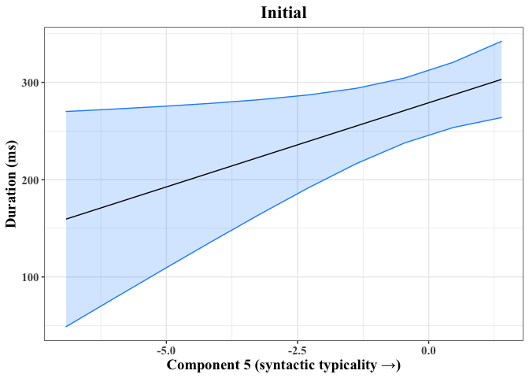<!-- -->

``` r
ggsave(d.init, file = "../Results/comp5_initial_plot.png", units="in", width = 5, height = 3.5, device = "png")
```

*4.2.2 Component 5, medial position*

``` r
new_data = with(orig_data, 
                expand.grid(lexICA5 = seq(min(lexICA5), 
                                              max(lexICA5), 
                                              length = 10),
                            lexICA1 = median(lexICA1),
                            lexICA2 = median(lexICA2),
                            lexICA3 = median(lexICA3),
                            lexICA4 = median(lexICA4),
                            lexICA6 = median(lexICA6),
                            lexICA7 = median(lexICA7),
                            lexICA8 = median(lexICA8),
                            lexICA9 = median(lexICA9),
                            IU.speech.rate.graph.per.sec_c = median(IU.speech.rate.graph.per.sec_c),
                            IU_len_ms_c = median(IU_len_ms_c),
                            BigSurp_c = median(BigSurp_c),
                            Det = "a",
                            Speaker = "AL",
                            Lemma = "air",
                            Animacy.simplified = "inanimate",
                            facPos = "medial"))

# Generate predicted values in log-odds (without random effects)
pred = predict(duration.in.position, 
               new_data, 
               type = "response", 
               se.fit = TRUE, 
               exclude = c("s(Speaker)", "s(Lemma)", "Det", "Animacy.simplified"))

# Add the predicted values to our hypothetical dataframe
pred = cbind(pred, new_data)

# Add CI
pred$lwr_ci = pred$fit - (2 * pred$se.fit)
pred$upr_ci = pred$fit + (2 * pred$se.fit)

# Plot the result
d.medi = ggplot(pred, aes(x = lexICA5, y = fit)) +
         geom_ribbon(aes(ymin = lwr_ci, ymax = upr_ci), 
                     fill = "dodgerblue",
                     color = "dodgerblue",
                     alpha = 0.2) +
         geom_line() +
         xlab("Component 5 (syntactic typicality →)") +
         ylab("Duration (ms)") +
         ggtitle("Medial") +
         theme_bw() +
         theme(text = element_text(family="Times New Roman",
                                   size=14,
                                   face="bold"),
               plot.title = element_text(hjust=0.5))

d.medi
```

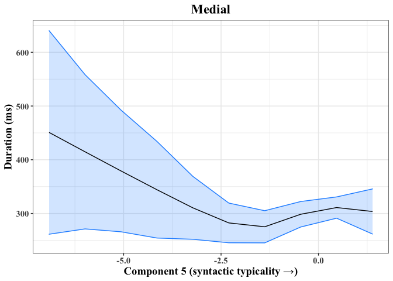<!-- -->

``` r
ggsave(d.medi, file = "../Results/comp5_medial_plot.png", units="in", width = 5, height = 3.5, device = "png")
```

*4.2.3 Component 5, final position*

``` r
new_data = with(orig_data, 
                expand.grid(lexICA5 = seq(min(lexICA5), 
                                              max(lexICA5), 
                                              length = 10),
                            lexICA1 = median(lexICA1),
                            lexICA2 = median(lexICA2),
                            lexICA3 = median(lexICA3),
                            lexICA4 = median(lexICA4),
                            lexICA6 = median(lexICA6),
                            lexICA7 = median(lexICA7),
                            lexICA8 = median(lexICA8),
                            lexICA9 = median(lexICA9),
                            IU.speech.rate.graph.per.sec_c = median(IU.speech.rate.graph.per.sec_c),
                            IU_len_ms_c = median(IU_len_ms_c),
                            BigSurp_c = median(BigSurp_c),
                            Det = "a",
                            Speaker = "AL",
                            Lemma = "air",
                            Animacy.simplified = "inanimate",
                            facPos = "final"))

# Generate predicted values in log-odds (without random effects)
pred = predict(duration.in.position, 
               new_data, 
               type = "response", 
               se.fit = TRUE, 
               exclude = c("s(Speaker)", "s(Lemma)", "Det", "Animacy.simplified"))

# Add the predicted values to our hypothetical dataframe
pred = cbind(pred, new_data)

# Add CI
pred$lwr_ci = pred$fit - (2 * pred$se.fit)
pred$upr_ci = pred$fit + (2 * pred$se.fit)

# Plot the result
d.fina = ggplot(pred, aes(x = lexICA5, y = fit)) +
         geom_ribbon(aes(ymin = lwr_ci, ymax = upr_ci), 
                     fill = "dodgerblue",
                     color = "dodgerblue",
                     alpha = 0.2) +
         geom_line() +
         xlab("Component 5 (syntactic typicality →)") +
         ylab("Duration (ms)") +
         ggtitle("Final") +
         theme_bw() +
         theme(text = element_text(family="Times New Roman",
                                   size=14,
                                   face="bold"),
               plot.title = element_text(hjust=0.5))

d.fina
```

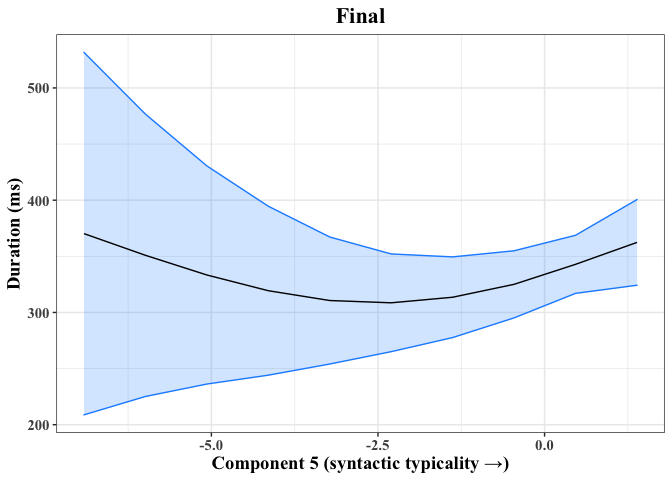<!-- -->

*4.2.4 Component 2, initial position*

``` r
new_data = with(orig_data, 
                expand.grid(lexICA2 = seq(min(lexICA2), 
                                              max(lexICA2), 
                                              length = 10),
                            lexICA1 = median(lexICA1),
                            lexICA5 = median(lexICA5),
                            lexICA3 = median(lexICA3),
                            lexICA4 = median(lexICA4),
                            lexICA6 = median(lexICA6),
                            lexICA7 = median(lexICA7),
                            lexICA8 = median(lexICA8),
                            lexICA9 = median(lexICA9),
                            IU.speech.rate.graph.per.sec_c = median(IU.speech.rate.graph.per.sec_c),
                            IU_len_ms_c = median(IU_len_ms_c),
                            BigSurp_c = median(BigSurp_c),
                            Det = "a",
                            Speaker = "AL",
                            Lemma = "air",
                            Animacy.simplified = "inanimate",
                            facPos = "initial"))

# Generate predicted values in log-odds (without random effects)
pred = predict(duration.in.position, 
               new_data, 
               type = "response", 
               se.fit = TRUE, 
               exclude = c("s(Speaker)", "s(Lemma)", "Det", "Animacy.simplified"))

# Add the predicted values to our hypothetical dataframe
pred = cbind(pred, new_data)

# Add CI
pred$lwr_ci = pred$fit - (2 * pred$se.fit)
pred$upr_ci = pred$fit + (2 * pred$se.fit)

# Plot the result
d.init.comp2 = ggplot(pred, aes(x = -lexICA2, y = fit)) +
         geom_ribbon(aes(ymin = lwr_ci, ymax = upr_ci), 
                     fill = "dodgerblue",
                     color = "dodgerblue",
                     alpha = 0.2) +
         geom_line() +
         xlab("Component 2 (syntactic diversity + frequency →)") +
         ylab("Duration (ms)") +
         ggtitle("Initial") +
         theme_bw() +
         theme(text = element_text(family="Times New Roman",
                                   size=14,
                                   face="bold"),
               plot.title = element_text(hjust=0.5)) 

d.init.comp2
```

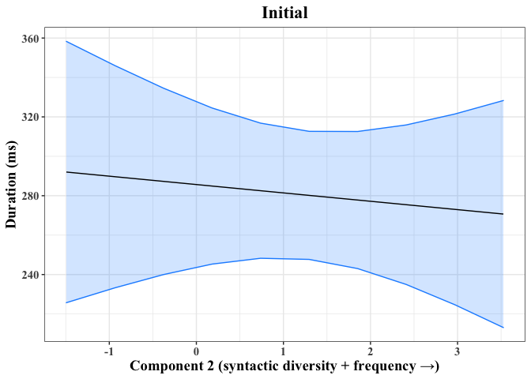<!-- -->

*4.2.5 Component 2, medial position*

``` r
new_data = with(orig_data, 
                expand.grid(lexICA2 = seq(min(lexICA2), 
                                              max(lexICA2), 
                                              length = 10),
                            lexICA1 = median(lexICA1),
                            lexICA5 = median(lexICA5),
                            lexICA3 = median(lexICA3),
                            lexICA4 = median(lexICA4),
                            lexICA6 = median(lexICA6),
                            lexICA7 = median(lexICA7),
                            lexICA8 = median(lexICA8),
                            lexICA9 = median(lexICA9),
                            IU.speech.rate.graph.per.sec_c = median(IU.speech.rate.graph.per.sec_c),
                            IU_len_ms_c = median(IU_len_ms_c),
                            BigSurp_c = median(BigSurp_c),
                            Det = "a",
                            Speaker = "AL",
                            Lemma = "air",
                            Animacy.simplified = "inanimate",
                            facPos = "medial"))

# Generate predicted values in log-odds (without random effects)
pred = predict(duration.in.position, 
               new_data, 
               type = "response", 
               se.fit = TRUE, 
               exclude = c("s(Speaker)", "s(Lemma)", "Det", "Animacy.simplified"))

# Add the predicted values to our hypothetical dataframe
pred = cbind(pred, new_data)

# Add CI
pred$lwr_ci = pred$fit - (2 * pred$se.fit)
pred$upr_ci = pred$fit + (2 * pred$se.fit)

# Plot the result
d.medi.comp2 = ggplot(pred, aes(x = -lexICA2, y = fit)) +
         geom_ribbon(aes(ymin = lwr_ci, ymax = upr_ci), 
                     fill = "dodgerblue",
                     color = "dodgerblue",
                     alpha = 0.2) +
         geom_line() +
         xlab("Component 2 (syntactic diversity + frequency →)") +
         ylab("Duration (ms)") +
         ggtitle("Medial") +
         theme_bw() +
         theme(text = element_text(family="Times New Roman",
                                   size=14,
                                   face="bold"),
               plot.title = element_text(hjust=0.5)) 

d.medi.comp2
```

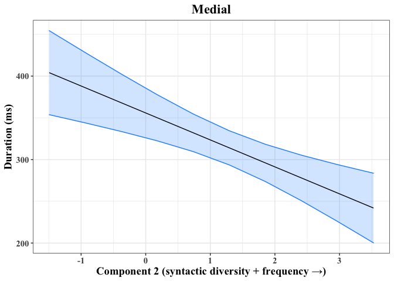<!-- -->

``` r
ggsave(d.medi.comp2, file = "../Results/comp2_medial_plot.png", units="in", width = 5, height = 3.5, device = "png")
```

*4.2.6 Component 2, final position*

``` r
new_data = with(orig_data, 
                expand.grid(lexICA2 = seq(min(lexICA2), 
                                              max(lexICA2), 
                                              length = 10),
                            lexICA1 = median(lexICA1),
                            lexICA5 = median(lexICA5),
                            lexICA3 = median(lexICA3),
                            lexICA4 = median(lexICA4),
                            lexICA6 = median(lexICA6),
                            lexICA7 = median(lexICA7),
                            lexICA8 = median(lexICA8),
                            lexICA9 = median(lexICA9),
                            IU.speech.rate.graph.per.sec_c = median(IU.speech.rate.graph.per.sec_c),
                            IU_len_ms_c = median(IU_len_ms_c),
                            BigSurp_c = median(BigSurp_c),
                            Det = "a",
                            Speaker = "AL",
                            Lemma = "air",
                            Animacy.simplified = "inanimate",
                            facPos = "final"))

# Generate predicted values in log-odds (without random effects)
pred = predict(duration.in.position, 
               new_data, 
               type = "response", 
               se.fit = TRUE, 
               exclude = c("s(Speaker)", "s(Lemma)", "Det", "Animacy.simplified"))

# Add the predicted values to our hypothetical dataframe
pred = cbind(pred, new_data)

# Add CI
pred$lwr_ci = pred$fit - (2 * pred$se.fit)
pred$upr_ci = pred$fit + (2 * pred$se.fit)

# Plot the result
d.fina.comp2 = ggplot(pred, aes(x = -lexICA2, y = fit)) +
         geom_ribbon(aes(ymin = lwr_ci, ymax = upr_ci), 
                     fill = "dodgerblue",
                     color = "dodgerblue",
                     alpha = 0.2) +
         geom_line() +
         xlab("Component 2 (syntactic diversity + frequency →)") +
         ylab("Duration (ms)") +
         ggtitle("Final") +
         theme_bw() +
         theme(text = element_text(family="Times New Roman",
                                   size=14,
                                   face="bold"),
               plot.title = element_text(hjust=0.5)) 

d.fina.comp2
```

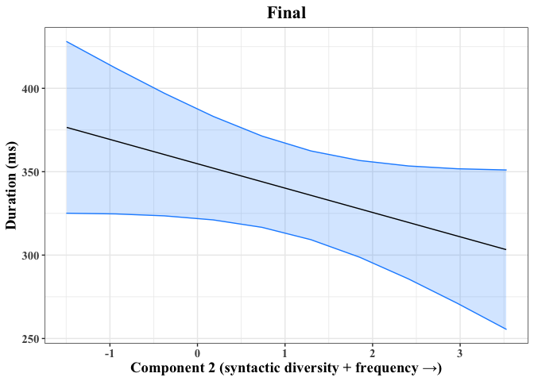<!-- -->

**NB**: To aid interpretation, we reverse the sign of the Component 2
values. The arrow in the x-axis label indicates how the variables
increase relative to the component scores.

**Randomly clipping lengths to simulate removal of final segment**  
An anonymous reviewer raised the possibility that our pre-trained forced
alignment model could suffer from biases in the identification of
segment boundaries, particularly in word-final position. The threat is
presumably more serious in phrase-final position as multiple sources
push for lengthening.

To address this point, we repeatedly clip the durations of individual
words by a randomly specified percentage of overall duration in ms. For
example, a word with true duration 150ms might be randomly assigned a
clipping value of .2 (1/5 of overall duration to be deleted). We
multiply the true duration by the clipping value, then subtract the
result from the true duration:

  
  

This
